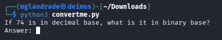
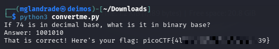

# picoCTF - convertme.py


This is my notes to complete the convertme.py from picoCTF!  

<br />
:::warning
**For obvious reasons, all the flags are hidden in this writeup.** 😉  
:::
<br />

--- 

## Room

:::note
https://play.picoctf.org/practice/challenge/239  
:::

import Tabs from '@theme/Tabs';
import TabItem from '@theme/TabItem';

<Tabs
  defaultValue="info"
  values={[
    {label: 'Info', value: 'info'},
    {label: 'Task file', value: 'file'},
    {label: 'Room Hints', value: 'hints'},
  ]}>
  <TabItem value="info">
  


|             |                                                                                            |
| ----------- | ------------------------------------------------------------------------------------------ |
| Description | Run the Python script and convert the given number from decimal to binary to get the flag. |
| Difficulty  | Easy                                                                                       |
| Author      | LT 'syreal' Jones                                                                          |


  
  </TabItem>
  <TabItem value="file">
  


    [Download task file](https://artifacts.picoctf.net/c/24/convertme.py)


  
  </TabItem>
  <TabItem value="hints">
  

  
    1. Look up a decimal to binary number conversion app on the web or use your computer's calculator!
    2. The str_xor function does not need to be reverse engineered for this challenge.
    3. If you have Python on your computer, you can download the script normally and run it. Otherwise, use the wget command in the webshell.
    4. To use wget in the webshell, first right click on the download link and select 'Copy Link' or 'Copy Link Address'
    5. Type everything after the dollar sign in the webshell: $ wget , then paste the link after the space after wget and press enter. This will download the script for you in the webshell so you can run it!
    6. Finally, to run the script, type everything after the dollar sign and then press enter: $ python3 convertme.py


  
  </TabItem>
</Tabs>  

<br />


---


## Get 'n run

First, I transferred the Python file to my machine, then I ran it.  
```sh
python3 convertme.py
```

<br />


In my example, he asked `If 74 is in decimal base, what is it in binary base?`, which asks to enter an `Answer` in binary code.  



<br />

And now, doing the conversion by head ~~(or obviously, using a conversor)~~, converted 74 in decimal to 100 1010 in binary, and upon submission it returned the flag.  




