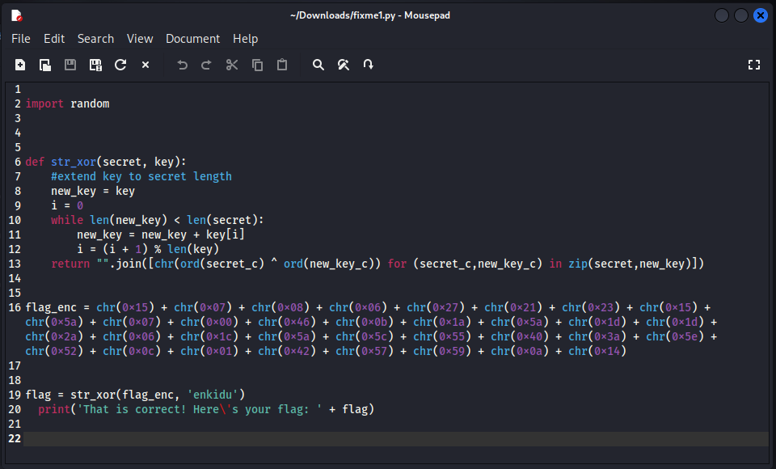
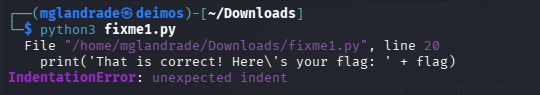
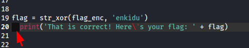
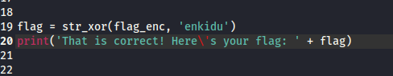
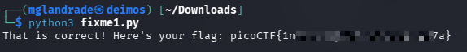

# picoCTF - fixme1.py


This is my notes to complete the fixme1.py from picoCTF!  

<br />
:::warning
**For obvious reasons, all the flags are hidden in this writeup.** 😉  
:::
<br />

--- 


## Room

:::note
https://play.picoctf.org/practice/challenge/240
:::

import Tabs from '@theme/Tabs';
import TabItem from '@theme/TabItem';

<Tabs
  defaultValue="info"
  values={[
    {label: 'Info', value: 'info'},
    {label: 'Task file', value: 'file'},
    {label: 'Room Hints', value: 'hints'},
  ]}>
  <TabItem value="info">
  


|             |                                                               |
| ----------- | ------------------------------------------------------------- |
| Description | Fix the syntax error in this Python script to print the flag. |
| Difficulty  | Easy                                                          |
| Author      | LT 'syreal' Jones                                             |


  
  </TabItem>
  <TabItem value="file">
  


    [Download python script](https://artifacts.picoctf.net/c/26/fixme1.py)


  
  </TabItem>
  <TabItem value="hints">
  

  
    1. Indentation is very meaningful in Python
    2. To view the file in the webshell, do: $ nano fixme1.py
    3. To exit nano, press Ctrl and x and follow the on-screen prompts.
    4. The str_xor function does not need to be reverse engineered for this challenge.


  
  </TabItem>
</Tabs>  

<br />


---


## First inspection

To solve this challenge, since it indicates that the Python code has errors, I started by opening the script in a text editor to check if I could find any obvious errors before running it.




Since I initially didn't see anything that could be wrong with the code, I decided to run the script in the terminal.

```python3
python3 fixme1.py
```



He printed the text to the terminal and indicated that there is an **error on line 20** of the script, more precisely  
`IndentationError: unexpected indent`
<br />


## Fixing 


Analyzing the indicated line, and knowing that the problem is the line indentation, I removed the two spaces from the beginning, since that line is not inside any block.



Ending up like this:  


<br />

After saving the changes, I ran the Python script again in the terminal, this time printing the room flag.



