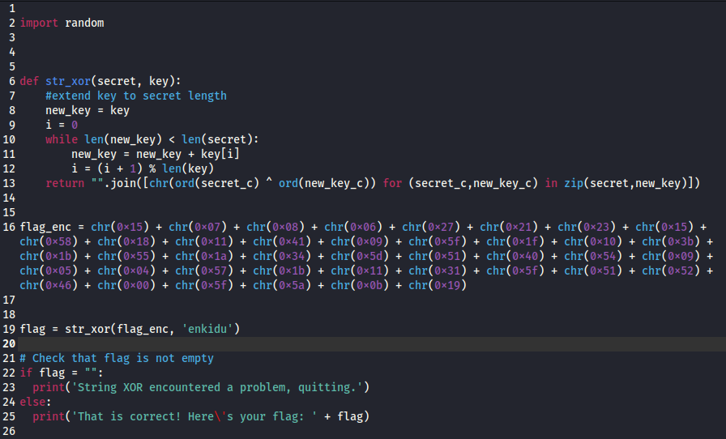
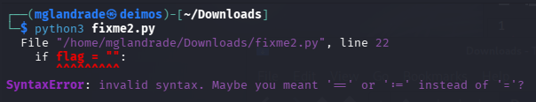
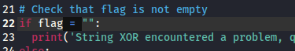
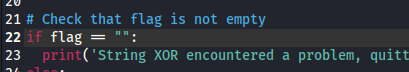
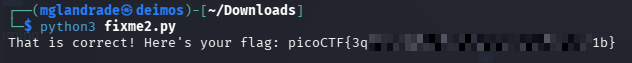

# picoCTF - fixme2.py

This is my notes to complete the fixme2.py from picoCTF!  

 
:::warning
**For obvious reasons, all the flags are hidden in this writeup.** 😉  
:::
 

--- 

## Room

:::note
https://play.picoctf.org/practice/challenge/241
:::

import Tabs from '@theme/Tabs';
import TabItem from '@theme/TabItem';

<Tabs
  defaultValue="info"
  values={[
    {label: 'Info', value: 'info'},
    {label: 'Task file', value: 'file'},
    {label: 'Room Hints', value: 'hints'},
  ]}>
  <TabItem value="info">
  

|             |                                                              |
| ----------- | ------------------------------------------------------------ |
| Description | Fix the syntax error in the Python script to print the flag. |
| Difficulty  | Easy                                                         |
| Author      | LT 'syreal' Jones                                            |

  
  </TabItem>
  <TabItem value="file">
  

    [Download python script](https://artifacts.picoctf.net/c/5/fixme2.py)

  
  </TabItem>
  <TabItem value="hints">
  

  
    1. Are equality and assignment the same symbol?
    2. To view the file in the webshell, do: $ nano fixme2.py
    3. To exit nano, press Ctrl and x and follow the on-screen prompts.
    4. The str_xor function does not need to be reverse engineered for this challenge.

  
  </TabItem>
</Tabs>  

 

---

## First inspection

To solve this challenge, since it indicates that the Python code has errors, I started by opening the script in a text editor to check if I could find any obvious errors before running it.  

At first glance, I didn't find any apparent errors in the code, so I decided to run it in the terminal, returning the following error.  

He printed that the error is on line 22 and that the problem has to do with:  
`SyntaxError: invalid syntax. Maybe you meant '==' or ':=' instead of '='`

 

## Fixing

I went to the indicated line and, as I could immediately see, the comparison operation was wrong.  

And correcting it ended up looking like this (with two "==").  

So I ran the script again, now returning the flag to the room.  

