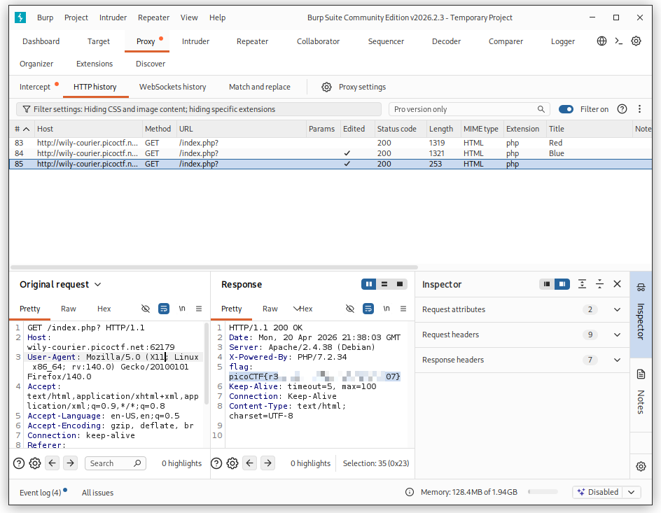

# picoCTF - GET aHEAD

This is my notes to complete the GET aHEAD from picoCTF!  

 
:::warning
**For obvious reasons, all the flags are hidden in this writeup.** 😉  
:::
 

--- 

## Room

:::note
https://play.picoctf.org/practice/challenge/132
:::

import Tabs from '@theme/Tabs';
import TabItem from '@theme/TabItem';

<Tabs
  defaultValue="info"
  values={[
    {label: 'Info', value: 'info'},
    {label: 'Room Hints', value: 'hints'},
  ]}>
  <TabItem value="info">
  

|             |                                                                         |
| ----------- | ----------------------------------------------------------------------- |
| Description | Find the flag being held on this server to get ahead of the competition |
| Difficulty  | Easy                                                                    |
| Author      | madStacks                                                               |

  
  </TabItem>
  <TabItem value="hints">
  

  
    1. Maybe you have more than 2 choices
    2. Check out tools like Burpsuite to modify your requests and look at the responses

  
  </TabItem>
</Tabs>  

 

---

## First recon

The website presents us with two buttons labeled **RED** and **BLUE**; Clicking on each option **changes the background color** of the page.  

  
  
 

Inspecting the page element through the browser's developer options, I noticed that the two existing buttons do not behave the same actions. The red button uses the `method="GET"` request, and the blue button uses the `method="POST"` request.  

 

## Exploiting

If we change the Red button's method from `"GET"` to `"POST"` and click the button, the **background changes to blue**.  

  
  

With that and thinking I could **obtain the flag through other method variables**, I try introducing other variables, such as **"HEAD**," since the room is called ***"GET aHEAD"***. 🤪  

  
[w3school Reference](https://www.w3schools.com/Tags/ref_httpmethods.asp)  
 

## Leaving the dead end

After a lot of trial and error trying to get a flag, I decided to check out the hints, in which suggest to use Burp Suite.  
In Burp Suite, I used the proxy > interceptor mode to capture the page before submitting it, modifying the method there.  

 

And with that, by submitting the modified capture, I obtained the challenge flag.

