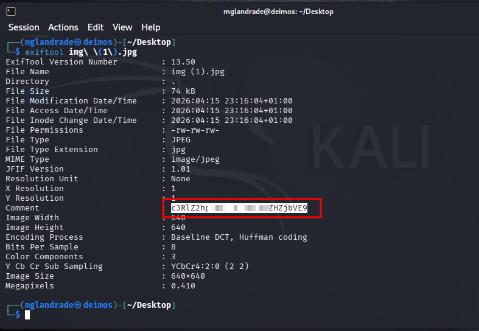
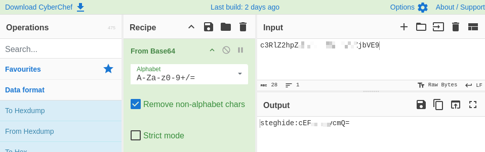
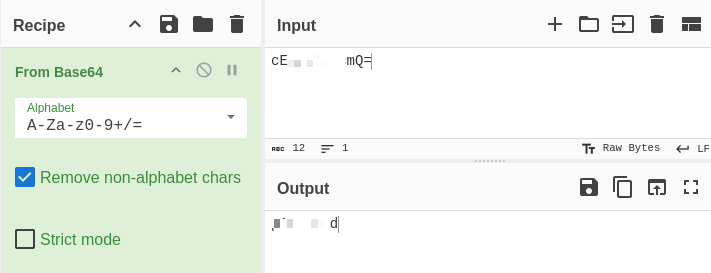
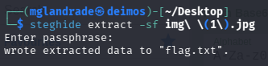
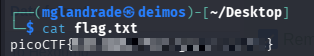

# picoCTF - Hidden in plainsight


This is my notes to complete the Hidden in plainsight from picoCTF!  

<br />
:::warning
**For obvious reasons, all the flags are hidden in this writeup.** 😉  
:::
<br />

--- 

## Room

:::note
https://play.picoctf.org/practice/challenge/524  
:::

import Tabs from '@theme/Tabs';
import TabItem from '@theme/TabItem';

<Tabs
  defaultValue="info"
  values={[
    {label: 'Info', value: 'info'},
    {label: 'Task Image', value: 'image'},
    {label: 'Room Hints', value: 'hints'},
  ]}>
  <TabItem value="info">
  


|             |                                                                                                                                                                          |
| ----------- | ------------------------------------------------------------------------------------------------------------------------------------------------------------------------ |
| Description | You’re given a seemingly ordinary JPG image. \n Something is tucked away out of sight inside the file. Your task is to discover the hidden payload and extract the flag. |
| Difficulty  | Easy                                                                                                                                                                     |
| Author      | Yahaya Meddy                                                                                                                                                             |


  
  </TabItem>
  <TabItem value="image">
  


    .jpg>)


  
  </TabItem>
  <TabItem value="hints">
  

  
    1. Download the jpg image and read its metadata


  
  </TabItem>
</Tabs>  

<br />


---

## exiftool

Using the hint given in this room, we are firt going to use the **exiftool** on kali to view his metadata.  
```
exiftool img (1).jpg
```



With this, I found a hidden comment in the metadata.

<br />

## Mysterious code decode

Since I didn't know what that code was, I entered it into **CyberChef** to check if it was something hidden on it.



As soon as I entered the code on the **CyberChef**, it suggested it should be a base64 code, which led to the decoding of a different hint.  

Looking closely at the code, it appeared to still be double-encoded, so I isolated and tried to converted it, which resulted in a passphrase. 🤩  

  

<br />

## Finding the hidden flag

With the previous code first decrypted, we obtained a clue to another program called **steghide**.  
Having no idea what **steghide** was, I checked the program's [online documentation repository](https://github.com/StegHigh/steghide) and looked for ways to decode the previous message.  

Using the command as described in the documentation to **extract something** from the task room image.  

```
steghide extract -sf img(1).jpg
```

Using this command, it **asked for a passphrase**, to which I **used the previous one** that I obtained by decrypting from base64.

  

In which, by decrypting the image, the **final flag** was extracted to a file.

  


