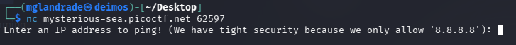
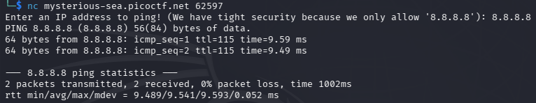
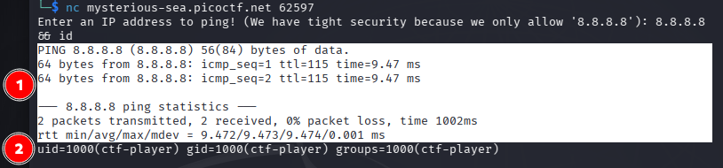
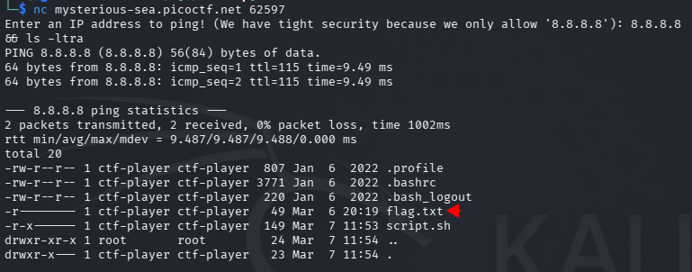
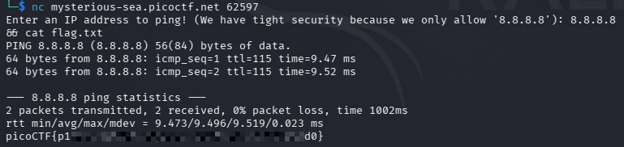

# picoCTF - ping-cmd


This is my notes to complete the ping-cmd from picoCTF!  

<br />
:::warning
**For obvious reasons, all the flags are hidden in this writeup.** 😉  
:::
<br />

--- 


## Room

:::note
https://play.picoctf.org/practice/challenge/757
:::

import Tabs from '@theme/Tabs';
import TabItem from '@theme/TabItem';

<Tabs
  defaultValue="info"
  values={[
    {label: 'Info', value: 'info'},
    {label: 'Room Hints', value: 'hints'},
  ]}>
  <TabItem value="info">
  


|             |                                                                                                                                                    |
| ----------- | -------------------------------------------------------------------------------------------------------------------------------------------------- |
| Description | Can you make the server reveal its secrets? It seems to be able to ping Google DNS, but what happens if you get a little creative with your input? |
| Difficulty  | Easy                                                                                                                                               |
| Author      | Yahaya Meddy                                                                                                                                       |


  
  </TabItem>
  <TabItem value="hints">
  

  
    1. The program uses a shell command behind the scenes.
    2. Sometimes, You can run more than one command at a time.


  
  </TabItem>
</Tabs>  

<br />


---

## Ping

In this room we need to start an instance; this instance gives us access via netcat remotely.  

While connected to the service, it only allows us **ONLY** to ping 8.8.8.8; if another IP or command is entered, it will quit.  





After checking one of the tips, it became clear that we could probably execute more than one command in addition to the ping, which I tested with an "id".

```
8.8.8.8 && id
```



<br />

## Pong

So, knowing that I can execute another command with the logical operator "&&" (logical AND), I listed the files that existed remotely.

```
8.8.8.8 && ls -ltra
```




Now that I knew which file I was interested in, I printed the contents of that file, returning the room flag.

```
8.8.8.8 && cat flag.txt
```


