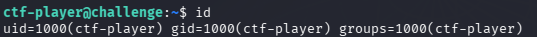
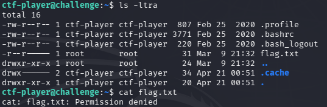
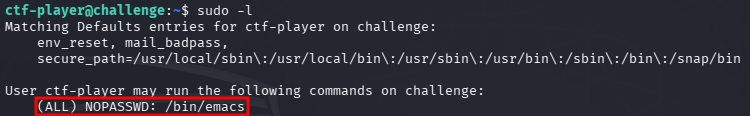
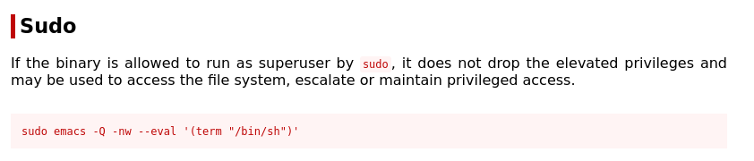
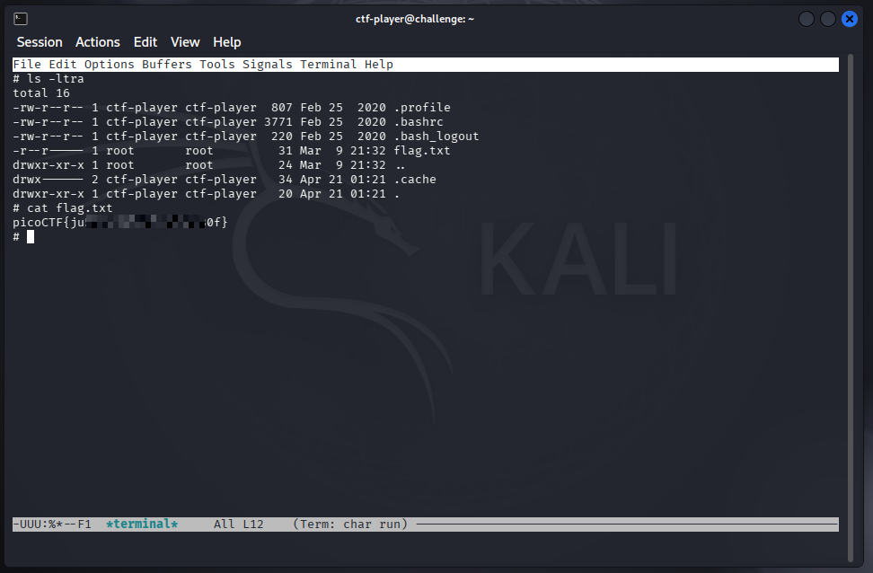

# picoCTF - SUDO MAKE ME A SANDWICH


This is my notes to complete the SUDO MAKE ME A SANDWICH from picoCTF!  

<br />
:::warning
**For obvious reasons, all the flags are hidden in this writeup.** 😉  
:::
<br />

--- 

## Room

:::note
https://play.picoctf.org/practice/challenge/735  
:::

import Tabs from '@theme/Tabs';
import TabItem from '@theme/TabItem';

<Tabs
  defaultValue="info"
  values={[
    {label: 'Info', value: 'info'},
    {label: 'Room Hints', value: 'hints'},
  ]}>
  <TabItem value="info">
  


|             |                                         |
| ----------- | --------------------------------------- |
| Description | Can you read the flag? I think you can! |
| Difficulty  | Easy                                    |
| Author      | Darkraicg492                            |


  
  </TabItem>
  <TabItem value="hints">
  

  
    1. What is sudo?
    2. How do you know what permission you have?


  
  </TabItem>
</Tabs>  

<br />


---


## Where is my sandwich?

For this challenge, I **need to connect via SSH** using a username and password to a remote machine.  
With the session established on the remote machine, I **started by verifying the user and the group**.  

  

<br />

After, I run `ls -ltra` on the **current directory**, it return a file called `flag.txt`, but it only has **read permission for the owner root**.  

  

<br />

## Give me my sandwich

With the **help of the first hint**, I ran `sudo -l` in the terminal, which returned that the **current user can run emacs text editor with sudo permissions**.  

  

<br />

To discover an exploit to escalate permissions using this text editor, I searched on [GTFOBins](https://web.archive.org/web/20260112035846/https://gtfobins.github.io./gtfobins/emacs/#sudo) by a command for such.  

  
```sh
sudo emacs -Q -nw --eval '(term "/bin/sh")'  
```

<br />

Now, with access to a makeshift terminal with root permissions via the emacs text editor, I ran `ls -ltra` and `cat flag.txt`, which retrieve the challenge flag.  

  

